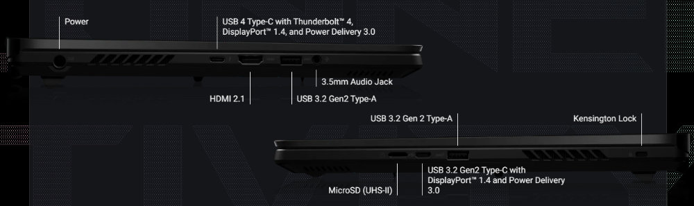

# `dotfiles`

Dotfiles managed with [`chezmoi`](https://github.com/twpayne/chezmoi).

Install `chezmoi` with:

```bash
sh -c "$(curl -fsLS git.io/chezmoi)"
```

Install and apply configuration with:

```bash
./bin/chezmoi init https://github.com/nicholaschiang/dotfiles.git --apply
```

## MacOS

### Tooling

First, install [`brew`](https://brew.sh):

```bash
/bin/bash -c "$(curl -fsSL https://raw.githubusercontent.com/Homebrew/install/HEAD/install.sh)"
```

Then, you can install my preferred development tooling:

```bash
brew install atuin bat btop eza fastfetch fish fzf git-delta kubectx k9s mise neovim rust starship tmux uv zoxide
```

You can then use [`mise`](https://mise.jdx.dev) to configure global `node` and `python` installations:

```bash
mise use --global node@22 python@3
```

When you first launch `vim` (or, rather, [`neovim`](https://github.com/neovim/neovim)), you will need to:

```
:PlugInstall
```

...to install all of my `vim` plugins (configured via [`vim-plug`](https://github.com/junegunn/vim-plug)).

I also install `rust` CLI tooling directly using `cargo`:

```bash
cargo install just ruplacer
```

### Applications

You can use `brew` to install my preferred GUI applications on MacOS:

```bash
brew install --cask docker-desktop firefox figma font-iosevka notion-calendar raycast wezterm alacritty
```

I typically use `wezterm` with `tmux` on MacOS, but `alacritty` is also very good.
From my experience, `alacritty` is faster than `wezterm` but is less feature rich (e.g. it does not support ligatures).

## Arch Linux

My preferred distro of choice is currently [Arch Linux](https://en.wikipedia.org/wiki/Arch_Linux), primarily because (a) I love that it comes with essentially nothing baked-in, (b) it has absolutely stellar documentation, and (c) it has an incredible package ecosystem in [AUR](https://en.wikipedia.org/wiki/Arch_Linux#AUR).

First, [install Arch](https://wiki.archlinux.org/title/Installation_guide).
I referenced these two guides ([1](https://gist.github.com/mjkstra/96ce7a5689d753e7a6bdd92cdc169bae), [2](https://gist.github.com/uosyph/bb7db7606c4916535081ae7b0f6bff2d)) when I installed Arch alongside an existing Windows 11 installation.
I had to resolve an issue with GRUB and LUKS encryption [this way](https://unix.stackexchange.com/questions/764872/luks-password-correct-but-not-accepted).

### Essentials

To configure WiFi:

```
❯ iwctl
```

To configure Bluetooth:

```
❯ bluetoothctl
```

To inspect the system:

```
❯ btop
❯ hostnamectl
❯ fastfetch
❯ neofetch
❯ uname -r
❯ pacman -Qs
```

### Boot Sequence

I no longer use GRUB (it is [slow](https://wiki.cachyos.org/installation/boot_managers/#cons-2) and [bloated](https://github.com/limine-bootloader/limine/blob/v8.x/PHILOSOPHY.md#why-not-support-filesystem-x-or-feature-y-eg-luks-lvm)).
I no longer encrypt the kernel `.img` files ([doing so is unnecessary](https://github.com/limine-bootloader/limine/blob/v8.x/PHILOSOPHY.md#what-about-luks-what-about-security-encrypt-the-kernel)).

I was going to setup [Limine](https://github.com/limine-bootloader/limine) instead (which [Omarchy uses](https://learn.omacom.io/2/the-omarchy-manual/101/system-snapshots?search=limine)), but Limine [lacks the ability to select the next boot entry programmatically](https://github.com/limine-bootloader/limine/issues/531), which is a must-have for me to [create a Windows desktop shortcut in Arch](https://bbs.archlinux.org/viewtopic.php?id=140049).
I also do not use many of the features of Limine (e.g. [snapshots](https://github.com/basecamp/omarchy/issues/1068)).
The CachyOS Wiki has [a good bootloader comparison table](https://wiki.cachyos.org/installation/boot_managers/#quick-feature-comparison).

Instead, I use `systemd-boot`.
I configured `systemd-boot` via `bootctl` by referencing the [Arch Linux Wiki](https://wiki.archlinux.org/title/Systemd-boot) and [this guide](https://allthings.how/replace-grub-with-systemd-boot-on-linux/).
I copied the necessary kernel options to load my encrypted [BTRFS](https://btrfs.readthedocs.io/en/latest/) volume from my previous `grub.cfg`.
I could have also gotten the necessary [persistent block device](https://wiki.archlinux.org/title/Persistent_block_device_naming) UUIDs from `lsblk -f` or [`blkid`](https://linuxhandbook.com/get-uuid-disk/).

In `/boot/efi/loader/entries/arch.conf`:

```
title   Arch Linux
linux   /vmlinuz-linux
initrd  /initramfs-linux.img
options root=UUID=2bdd61b8-be29-44b5-a699-a2118aa6305e rw rootflags=subvol=@ cryptdevice=UUID=1459c007-fe70-4092-a22b-363eda9eaede:root zswap.enabled=0 rootfstype=btrfs
```

In `/boot/efi/loader/entries/arch-fallback.conf`:

```
title   Arch Linux (fallback initramfs)
linux   /vmlinuz-linux
initrd  /initramfs-linux-fallback.img
options root=UUID=2bdd61b8-be29-44b5-a699-a2118aa6305e rw rootflags=subvol=@ cryptdevice=UUID=1459c007-fe70-4092-a22b-363eda9eaede:root zswap.enabled=0 rootfstype=btrfs
```

My BTRFS setup aligns with the default provided by the `archinstall` TUI:

```
❯ sudo btrfs subvolume list /
[sudo] password for nchiang:
ID 256 gen 174764 top level 5 path @
ID 257 gen 174764 top level 5 path @home
ID 258 gen 174764 top level 5 path @log
ID 259 gen 174617 top level 5 path @pkg
ID 260 gen 7603 top level 256 path var/lib/portables
ID 261 gen 7603 top level 256 path var/lib/machines
❯ lsblk -f
NAME        FSTYPE      FSVER            LABEL       UUID                                 FSAVAIL FSUSE% MOUNTPOINTS
sda
├─sda1
└─sda2      exfat       1.0              X9 Pro      ACA5-33DF
sdb         iso9660     Joliet Extension ARCH_202509 2025-09-01-16-37-02-00
├─sdb1      iso9660     Joliet Extension ARCH_202509 2025-09-01-16-37-02-00
└─sdb2      vfat        FAT32            ARCHISO_EFI 68B5-CBAE
zram0       swap        1                zram0       585a6947-4e2d-48fe-8411-448e13116955                [SWAP]
nvme0n1
├─nvme0n1p1 vfat        FAT32            SYSTEM      48EA-8E84
├─nvme0n1p2
├─nvme0n1p3 BitLocker   2                            79e130d4-0616-41ff-b4ed-9fa641aff8a9
├─nvme0n1p4 ntfs                                     8CE06ED7E06EC754
├─nvme0n1p5 ntfs                         RESTORE     4EEC1B1BEC1AFD41
├─nvme0n1p6 vfat        FAT32            MYASUS      341B-2A97
├─nvme0n1p7 vfat        FAT32                        FFBD-D04F                             150.3M    50% /boot/efi
├─nvme0n1p8 swap        1                            27a98047-7832-4e79-b613-5b536d5bc626                [SWAP]
└─nvme0n1p9 crypto_LUKS 2                            1459c007-fe70-4092-a22b-363eda9eaede
  └─root    btrfs                                    2bdd61b8-be29-44b5-a699-a2118aa6305e   75.3G    50% /var/log
                                                                                                         /var/cache/pacman/pkg
                                                                                                         /home
                                                                                                         /
❯ sudo findmnt -nt btrfs
/                       /dev/mapper/root[/@]     btrfs rw,relatime,compress=zstd:3,ssd,space_cache=v2,subvolid=256,subvol=/@
├─/home                 /dev/mapper/root[/@home] btrfs rw,relatime,compress=zstd:3,ssd,space_cache=v2,subvolid=257,subvol=/@home
├─/var/cache/pacman/pkg /dev/mapper/root[/@pkg]  btrfs rw,relatime,compress=zstd:3,ssd,space_cache=v2,subvolid=259,subvol=/@pkg
└─/var/log              /dev/mapper/root[/@log]  btrfs rw,relatime,compress=zstd:3,ssd,space_cache=v2,subvolid=258,subvol=/@log
```

...the extra partitions on my SSD (`nvme0n1`) are used by the existing Windows installation.

I copied the kernel files from `/boot` (which lives on the encrypted BTRFS partition) to `/boot/efi` (which is the 300MB EFI partition).
Previously, `grub` handled decrypting `/boot` before loading the kernel.
This was very slow, required entering the same decryption passphrase twice, and `systemd-boot` does not support loading encrypted kernel files.
I was unable to copy the `initramfs-linux-fallback.img` file from the `/boot` directory (on my encrypted BTRFS partition) due to lack of space (on my 300MB EFI partition mounted to `/boot/efi`).

While `systemd-boot` will [automatically check](https://wiki.archlinux.org/title/Systemd-boot#Adding_loaders) at boot time for `/EFI/Microsoft/Boot/Bootmgfw.efi`, my "Windows Boot Manager" was located in a separate EFI partition and thus [required configuration](https://wiki.archlinux.org/title/Systemd-boot#Boot_from_another_disk).
I determined the FS alias of the EFI partition by using the [UEFI shell](https://wiki.archlinux.org/title/UEFI_shell) (installed via [`edk2-shell`](https://wiki.archlinux.org/title/Systemd-boot#UEFI_Shells_or_other_EFI_applications)) and comparing the output with `sudo blkid`:

```
Shell> map
Mapping table
FSO: Alias(s):CD0f0b:;BLK2:
    PciRoot(0x0)/Pci(0x14,0x0)/USB(0x5,0x0)/CDROM(0x1)
FS1: Alias(s):HD1b:;BLK7:
    PciRoot(0x0)/Pci(0xE,0x0)/NVMe(0x1,C2-96-5C-3C-01-75-A0-00)/HD(1,GPT,DECF284C-0B62-4D09-A598-8B06198A20EE,0x800,0X82000)
FS2: Alias(s):HD1g:;BLK12:
    PciRoot(0x0)/Pci(0xE,0X0)/NVMe(0x1,C2-96-5C-3C-01-75-A0-00)/HD(6,GPT,FF98FCA0-7E96-4279-92FF-C24D7B0A4ED1,0X7733B000,0x82000)
...
```

```
❯ sudo blkid
/dev/nvme0n1p9: UUID="1459c007-fe70-4092-a22b-363eda9eaede" TYPE="crypto_LUKS" PARTUUID="143b6881-0878-4534-a943-70e763abb1ea"
/dev/nvme0n1p7: UUID="FFBD-D04F" BLOCK_SIZE="512" TYPE="vfat" PARTUUID="86c94f64-f9d3-49a5-ac2c-ea4f1b26b93e"
/dev/nvme0n1p5: LABEL="RESTORE" BLOCK_SIZE="512" UUID="4EEC1B1BEC1AFD41" TYPE="ntfs" PARTLABEL="Basic data partition" PARTUUID="2b42c37e-564a-4ae0-98e7-973d50744b62"
/dev/nvme0n1p3: UUID="79e130d4-0616-41ff-b4ed-9fa641aff8a9" TYPE="BitLocker" PARTLABEL="Basic data partition" PARTUUID="7ffde51e-2f89-449b-9675-4d3c2fcac1a6"
/dev/nvme0n1p1: LABEL="SYSTEM" UUID="48EA-8E84" BLOCK_SIZE="512" TYPE="vfat" PARTLABEL="EFI system partition" PARTUUID="decf284c-0b62-4d09-a598-8b06198a20ee"
/dev/nvme0n1p8: UUID="27a98047-7832-4e79-b613-5b536d5bc626" TYPE="swap" PARTUUID="4b56fe9c-b512-4c31-8929-e9804f9a0a55"
/dev/nvme0n1p6: LABEL="MYASUS" UUID="341B-2A97" BLOCK_SIZE="512" TYPE="vfat" PARTLABEL="Basic data partition" PARTUUID="ff98fca0-7e96-4279-92ff-c24d7b0a4ed1"
/dev/nvme0n1p4: BLOCK_SIZE="512" UUID="8CE06ED7E06EC754" TYPE="ntfs" PARTUUID="5f93ca63-50b1-441d-a0e7-f7535faa0b95"
/dev/nvme0n1p2: PARTLABEL="Microsoft reserved partition" PARTUUID="660bc4ee-985b-4a71-bb21-da13bc2a17c9"
/dev/sdb2: LABEL_FATBOOT="ARCHISO_EFI" LABEL="ARCHISO_EFI" UUID="68B5-CBAE" BLOCK_SIZE="512" TYPE="vfat" PARTUUID="2d9d5c0b-02"
/dev/sdb1: BLOCK_SIZE="2048" UUID="2025-09-01-16-37-02-00" LABEL="ARCH_202509" TYPE="iso9660" PARTUUID="2d9d5c0b-01"
/dev/mapper/root: UUID="2bdd61b8-be29-44b5-a699-a2118aa6305e" UUID_SUB="4b804401-8ba4-4014-a088-67feca675a34" BLOCK_SIZE="4096" TYPE="btrfs"
/dev/sda2: LABEL="X9 Pro" UUID="ACA5-33DF" BLOCK_SIZE="512" TYPE="exfat" PARTLABEL="Basic data partition" PARTUUID="80b33855-35c4-4a15-8e81-f0430ec2e66b"
/dev/sda1: PARTLABEL="Microsoft reserved partition" PARTUUID="ecfc4322-72f3-4cc1-b3e6-8d3f63ef2cf0"
/dev/zram0: LABEL="zram0" UUID="585a6947-4e2d-48fe-8411-448e13116955" TYPE="swap"
```

In `/boot/efi/loader/entries/windows.conf`:

```
title   Windows
efi     /shellx64.efi
options -nointerrupt -nomap -noversion HD1b:EFI\Microsoft\Boot\Bootmgfw.efi
```

In `/boot/efi/loader/loader.conf`, I configured `systemd-boot` to load `arch.conf` by default:

```
default arch.conf
timeout 0
console-mode max
```

After confirming `systemd-boot` worked as expected, I removed `grub`:

```
sudo pacman -Rcnsu grub
sudo rm -rf /boot/grub /boot/efi/grub
```

I booted from a USB to move `/boot/efi` to `/boot` by editing `/etc/fstab` and removing the contents of `/boot`.

### Display Manager

I use [SDDM](https://wiki.archlinux.org/title/SDDM) to [automatically login](https://wiki.archlinux.org/title/SDDM#Autologin) and launch `sway` after disk decryption.

```
❯ yay -S sddm
❯ sudo systemctl enable sddm.service
```

In `/etc/sddm.conf.d/autologin.conf`:

```
[Autologin]
User=nchiang
Session=sway
```

In `/usr/share/wayland-sessions/sway.desktop`:

```
[Desktop Entry]
Name=Sway
Comment=An i3-compatible Wayland compositor
Exec=sway --unsupported-gpu
Type=Application
DesktopNames=sway;wlroots
```

I added the `--unsupported-gpu` option which is required to use the [`nvidia-open`](https://archlinux.org/packages/?name=nvidia-open) GPU drivers with [`sway`](https://wiki.archlinux.org/title/Sway#From_a_display_manager).

### Graphical Login

I use [Plymouth](https://wiki.archlinux.org/title/Plymouth) to enter my disk decryption password on login.

In `/etc/mkinitcpio.conf`:

```
HOOKS=(base udev autodetect microcode modconf kms keyboard keymap consolefont block plymouth encrypt filesystems fsck)
```

To ensure the [`nvidia-open`](https://archlinux.org/packages/?name=nvidia-open) GPU drivers [are loaded before](https://wiki.archlinux.org/title/NVIDIA#Early_loading) Plymouth runs:

In `/etc/modprobe.d/nvidia.conf`:

```
options nvidia_drm modeset=1
```

In `/etc/mkinitcpio.conf`:

```
MODULES=(nvidia nvidia_modeset nvidia_uvm nvidia_drm btrfs)
```

...these changes were inspired by [this Omarchy script](https://github.com/basecamp/omarchy/blob/cfbc71c1171cec907383d2a9623e8d5743f96764/install/config/hardware/nvidia.sh).

I then [regenerated](https://wiki.archlinux.org/title/Mkinitcpio#Manual_generation) the [initramfs](https://wiki.archlinux.org/title/Arch_boot_process#initramfs):

```
❯ sudo mkinitcpio -P
```

I have a [2023 ASUS ROG Zephyrus M16](https://rog.asus.com/us/laptops/rog-zephyrus/rog-zephyrus-m16-2023-series/spec/) ([GU604VI-M16.I94070](https://kelaptop.com/en/asus-rog-zephyrus-m16-gu604vi-i94070-gu604vi-m16-i94070)).
I had to go into the BIOS and set the display mode to "dGPU" (to always use the discrete NVIDIA 4070 laptop GPU).
I had to switch my primary [LG 45GX950A-B display](https://www.lg.com/ca_en/monitors/gaming/45gx950a-b/) cable to the USB 3.2 Gen2 Type-C with DisplayPort 1.4 port (right side).
This USB-C port (right side) is [connected to the discrete GPU](https://www.reddit.com/r/ZephyrusM16/comments/o70if7/thunderbolt_on_the_m16/) while the USB 4 Type-C with Thunderbolt 4 port (left side) is connected to the integrated Intel GPU.
I have a secondary display (a [65" LG TV](https://www.lg.com/us/tvs/lg-oled65c3pua-oled-4k-tv) mounted above my desk) connected to the HDMI 2.1 port (left side).
This HDMI port is also connected to the discrete GPU.
Other Zephyrus laptops [have similar port configurations](https://rog-forum.asus.com/t5/gaming-notebooks/zephyrus-g16-gu605cw-dgpu-external-monitor-not-recognized/td-p/1093855).

[](https://faq.windowstip.com/what-port-on-a-asus-rog-zephyrus-m16-2023/)

### Tooling

Then, from your fresh Arch installation, install [`yay`](https://github.com/Jguer/yay?tab=readme-ov-file#installation):

```bash
sudo pacman -S --needed git base-devel
git clone https://aur.archlinux.org/yay.git
cd yay
makepkg -si
```

Then, you can install my preferred development tooling.
You can either run the script I made:

```bash
./install.sh
```

Or, run the command yourself manually (cherry-picking which tools to install):

```bash
yay -S \
  alacritty \
  atuin \
  base \
  base-devel \
  bat \
  bottom \
  btop \
  btrfs-progs \
  brightnessctl \
  chezmoi \
  chromium \
  dnsmasq \
  dunst \
  efibootmgr \
  eza \
  fastfetch \
  firefox \
  fish \
  fzf \
  git \
  git-delta \
  git-lfs \
  grub \
  gst-plugin-pipewire \
  intel-ucode \
  iwd \
  just \
  k9s \
  kanshi \
  less \
  libpulse \
  libvirt \
  linux \
  linux-firmware \
  man-db \
  mise \
  neovim \
  openssh \
  pamixer \
  pipewire \
  pipewire-alsa \
  pipewire-jack \
  pipewire-pulse \
  playerctl \
  postgresql \
  python-poetry \
  qemu-full \
  ripgrep \
  rofi-bluetooth-git \
  rofi-wayland \
  rust \
  sof-firmware \
  starship \
  sway \
  swaybg \
  swayidle \
  swaylock \
  sway-contrib \
  swtpm \
  tldr \
  ttc-iosevka \
  ttf-font-awesome \
  ttf-iosevka-nerd \
  usage \
  uv \
  virt-manager \
  waybar \
  wezterm \
  wget \
  wireplumber \
  wl-clipboard \
  yay \
  yay-debug \
  zoxide \
  zram-generator
```

I currently have the following packages installed:

```
❯ yay -Qe
1password 8.11.22-27
adwaita-qt5-git 1.4.1.r29.g0a77436-1
adwaita-qt6-git 1.4.1.r29.g0a77436-1
alacritty 0.16.1-1
android-studio 2025.2.2.7-1
apple-fonts 7.0.3-1
asusctl 6.1.22-0.1
atuin 18.10.0-1
aws-cli-v2 2.32.16-1
base 3-2
base-devel 1-2
bat 0.26.1-1
bind 9.20.16-1
bluez 5.85-1
bottom 0.11.4-1
brightnessctl 0.5.1-3
btop 1.4.5-1
btrfs-progs 6.17.1-1
chatblade 0.7.0-2
chezmoi 2.68.1-1
chromium 143.0.7499.109-1
cmatrix 2.0-4
countryfetch 0.2.0-1
croc 1:10.3.1-1
ddgr 2.2-1
discord 1:0.0.119-1
dmidecode 3.6-1
dnsmasq 2.91-1
docker 1:29.1.3-1
docker-compose 5.0.0-1
dunst 1.13.0-1
edk2-shell 202508-1
efibootmgr 18-3
eog 47.0-3
eza 0.23.4-1
fastfetch 2.56.0-1
fd 10.3.0-1
ffmpegthumbnailer 2.2.4-1
firefox 146.0-1
fish 4.2.1-1
flameshot 13.3.0-2
fzf 0.67.0-1
git 2.52.0-2
git-delta 0.18.2-6
git-lfs 3.7.1-1
github-cli 2.83.2-1
globalprotect-openconnect-git 2.4.5.r0.g2aa875a-1
gnome-themes-extra 1:3.28-1
gst-plugin-pipewire 1:1.4.9-2
helix 25.07.1-1
huenicorn 1.0.11-4
icloudpd-bin 1.32.2-1
imagemagick 7.1.2.11-1
impala 0.6.0-1
imv 5.0.1-1
intel-ucode 20251111-1
iwd 3.10-1
jira-cli 1.7.0-1
jujutsu-git 0.35.0.r91.g54511ee3f-1
just 1.45.0-1
k9s 0.50.16-1
kanshi 1.8.0-2
kubectx 0.9.5-1
less 1:685-1
libpulse 17.0+r93+gbe2efb69b-1
libvirt 1:11.10.0-1
linux 6.17.9.arch1-1
linux-firmware 20251125-2
linux-headers 6.17.9.arch1-1
localsend 1.17.0-2
lutris 0.5.19-6
magic-wormhole 0.21.1-1
man-db 2.13.1-1
man-pages 6.16-1
mediainfo 25.10-1
minecraft-launcher 1:2.1.3-3
mise 2025.11.3-1
mpv 1:0.40.0-7
mullvad-vpn 2025.14-1
neofetch 7.1.0-2
neovim 0.11.5-1
nginx 1.28.0-4
nmap 7.98-3
nnn 5.1-1
noto-fonts-emoji 1:2.051-1
nvidia-open 580.105.08-6
obs-studio 32.0.2-2
ollama 0.13.3-1
ollama-docs 0.13.3-1
openssh 10.2p1-2
os-prober 1.83-1
otf-aurulent-nerd 3.4.0-1
otf-codenewroman-nerd 3.4.0-1
otf-comicshanns-nerd 3.4.0-1
otf-commit-mono-nerd 3.4.0-1
otf-droid-nerd 3.4.0-1
otf-firamono-nerd 3.4.0-1
otf-geist-mono-nerd 3.4.0-1
otf-hasklig-nerd 3.4.0-1
otf-hermit-nerd 3.4.0-1
otf-monaspace-nerd 3.4.0-1
otf-opendyslexic-nerd 3.4.0-1
otf-overpass-nerd 3.4.0-1
pamixer 1.6-3
pandoc-bin 3.8.3-1
pandoc-eisvogel-template 3.3.0-1
pipewire 1:1.4.9-2
pipewire-alsa 1:1.4.9-2
pipewire-docs 1:1.4.9-2
pipewire-jack 1:1.4.9-2
pipewire-pulse 1:1.4.9-2
polychromatic 0.9.5-1
postgresql 18.1-1
power-profiles-daemon 0.30-1
prismlauncher 9.4-1
python-poetry 2.2.1-1
qemu-full 10.1.2-3
racket 9.0-1
razer-cli 2.3.0-3
ripgrep 15.1.0-1
rofi 2.0.0-1
rofi-bluetooth-git r41.0cca4d4-1
rog-control-center 6.1.22-0.1
rsync 3.4.1-2
rustcraft 0.8-3
satty 0.20.0-1
sddm 0.21.0-6
signal-desktop 7.82.0-1
slack-desktop-wayland 4.46.96-1
slugify 1.0.1-1
sof-firmware 2025.05.1-1
speedtest-cli 2.1.3-9
starship 1.24.1-1
steam 1.0.0.85-1
sway-contrib 1.11-1
sway-git 1.12.r7616.b54d120-1
swaybg 1.2.1-1
swayidle 1.9.0-1
swaylock 1.8.4-1
swtpm 0.10.1-1
tailscale 1.92.1-1
tectonic 0.15.0-4
thefuck 3.32-11
thunar 4.20.6-1
tldr 3.4.3-2
tmux 3.6_a-1
traceroute 2.1.6-1
ttc-iosevka 33.3.6-1
ttf-0xproto-nerd 3.4.0-1
ttf-3270-nerd 3.4.0-1
ttf-agave-nerd 3.4.0-1
ttf-anonymouspro-nerd 3.4.0-1
ttf-arimo-nerd 3.4.0-1
ttf-bigblueterminal-nerd 3.4.0-1
ttf-bitstream-vera-mono-nerd 3.4.0-1
ttf-cascadia-code-nerd 3.4.0-1
ttf-cascadia-mono-nerd 3.4.0-1
ttf-cousine-nerd 3.4.0-1
ttf-d2coding-nerd 3.4.0-1
ttf-daddytime-mono-nerd 3.4.0-1
ttf-dejavu-nerd 3.4.0-1
ttf-envycoder-nerd 3.4.0-1
ttf-fantasque-nerd 3.4.0-1
ttf-firacode-nerd 3.4.0-1
ttf-font-awesome-4 4.7.0-7
ttf-go-nerd 3.4.0-1
ttf-gohu-nerd 3.4.0-1
ttf-hack-nerd 3.4.0-1
ttf-heavydata-nerd 3.4.0-1
ttf-iawriter-nerd 3.4.0-1
ttf-ibmplex-mono-nerd 3.4.0-1
ttf-inconsolata-go-nerd 3.4.0-1
ttf-inconsolata-lgc-nerd 3.4.0-1
ttf-inconsolata-nerd 3.4.0-1
ttf-intone-nerd 3.4.0-1
ttf-iosevka-nerd 3.4.0-1
ttf-iosevkaterm-nerd 3.4.0-1
ttf-iosevkatermslab-nerd 3.4.0-1
ttf-jetbrains-mono-nerd 3.4.0-1
ttf-lekton-nerd 3.4.0-1
ttf-liberation-mono-nerd 3.4.0-1
ttf-lilex-nerd 3.4.0-1
ttf-martian-mono-nerd 3.4.0-1
ttf-meslo-nerd 3.4.0-1
ttf-monofur-nerd 3.4.0-1
ttf-monoid-nerd 3.4.0-1
ttf-mononoki-nerd 3.4.0-1
ttf-mplus-nerd 3.4.0-1
ttf-nerd-fonts-symbols 3.4.0-1
ttf-nerd-fonts-symbols-mono 3.4.0-1
ttf-noto-emoji-monochrome 1.1.0-2
ttf-noto-nerd 3.4.0-1
ttf-profont-nerd 3.4.0-1
ttf-proggyclean-nerd 3.4.0-1
ttf-recursive-nerd 3.4.0-1
ttf-roboto-mono-nerd 3.4.0-1
ttf-sharetech-mono-nerd 3.4.0-1
ttf-sourcecodepro-nerd 3.4.0-1
ttf-space-mono-nerd 3.4.0-1
ttf-terminus-nerd 3.4.0-1
ttf-tinos-nerd 3.4.0-1
ttf-ubuntu-mono-nerd 3.4.0-1
ttf-ubuntu-nerd 3.4.0-1
ttf-victor-mono-nerd 3.4.0-1
ttf-zed-mono-nerd 3.4.0-1
tumbler 4.20.1-1
turso-cli 0.87.2-1
unzip 6.0-23
usage 2.6.0-1
usbutils 019-1
uv 0.9.17-1
v4l2loopback-dkms 0.15.3-1
v4l2loopback-utils 0.15.3-1
vim 9.1.1975-1
virt-manager 5.1.0-1
vlc 3.0.21-32
vlc-plugin-ffmpeg 3.0.21-32
vulkan-nouveau 1:25.3.1-2
vulkan-tools 1.4.335.0-1
waybar 0.14.0-5
webtorrent-cli 5.1.3-1
wezterm-git 20240203.110809.r790.gd3b0fda-1
wf-recorder 0.6.0-1
wget 1.25.0-3
wireplumber 0.5.12-1
wl-clipboard 1:2.2.1-3
wlroots-git 0.20.0.r7653.106f0f95-1
woff2-font-awesome 7.1.0-1
xdg-desktop-portal-gtk 1.15.3-1
xdg-desktop-portal-wlr-git 0.8.0.r0.g0ab4f6f-1
xorg-xwayland 24.1.9-1
yay 12.5.7-1
yt-dlp 2025.12.08-1
zip 3.0-11
zoom 6.6.11-1
zoxide 0.9.8-2
zram-generator 1.2.1-1
```

My current `/etc/mkinitcpio.conf`, modified to load NVIDIA drivers and keyboard detection before prompting for a drive decryption password:

```
# vim:set ft=sh
# MODULES
# The following modules are loaded before any boot hooks are
# run.  Advanced users may wish to specify all system modules
# in this array.  For instance:
#     MODULES=(usbhid xhci_hcd)
MODULES=(nvidia nvidia_modeset nvidia_uvm nvidia_drm btrfs)

# BINARIES
# This setting includes any additional binaries a given user may
# wish into the CPIO image.  This is run last, so it may be used to
# override the actual binaries included by a given hook
# BINARIES are dependency parsed, so you may safely ignore libraries
BINARIES=(/usr/bin/btrfs)

# FILES
# This setting is similar to BINARIES above, however, files are added
# as-is and are not parsed in any way.  This is useful for config files.
FILES=()

# HOOKS
# This is the most important setting in this file.  The HOOKS control the
# modules and scripts added to the image, and what happens at boot time.
# Order is important, and it is recommended that you do not change the
# order in which HOOKS are added.  Run 'mkinitcpio -H <hook name>' for
# help on a given hook.
# 'base' is _required_ unless you know precisely what you are doing.
# 'udev' is _required_ in order to automatically load modules
# 'filesystems' is _required_ unless you specify your fs modules in MODULES
# Examples:
##   This setup specifies all modules in the MODULES setting above.
##   No RAID, lvm2, or encrypted root is needed.
#    HOOKS=(base)
#
##   This setup will autodetect all modules for your system and should
##   work as a sane default
#    HOOKS=(base udev autodetect modconf block filesystems fsck)
#
##   This setup will generate a 'full' image which supports most systems.
##   No autodetection is done.
#    HOOKS=(base udev modconf block filesystems fsck)
#
##   This setup assembles a mdadm array with an encrypted root file system.
##   Note: See 'mkinitcpio -H mdadm_udev' for more information on RAID devices.
#    HOOKS=(base udev modconf keyboard keymap consolefont block mdadm_udev encrypt filesystems fsck)
#
##   This setup loads an lvm2 volume group.
#    HOOKS=(base udev modconf block lvm2 filesystems fsck)
#
##   This will create a systemd based initramfs which loads an encrypted root filesystem.
#    HOOKS=(base systemd autodetect modconf kms keyboard sd-vconsole sd-encrypt block filesystems fsck)
#
##   NOTE: If you have /usr on a separate partition, you MUST include the
#    usr and fsck hooks.
HOOKS=(base udev keyboard autodetect microcode modconf kms keymap consolefont block encrypt filesystems fsck)

# COMPRESSION
# Use this to compress the initramfs image. By default, zstd compression
# is used for Linux ≥ 5.9 and gzip compression is used for Linux < 5.9.
# Use 'cat' to create an uncompressed image.
#COMPRESSION="zstd"
#COMPRESSION="gzip"
#COMPRESSION="bzip2"
#COMPRESSION="lzma"
#COMPRESSION="xz"
#COMPRESSION="lzop"
#COMPRESSION="lz4"

# COMPRESSION_OPTIONS
# Additional options for the compressor
#COMPRESSION_OPTIONS=()

# MODULES_DECOMPRESS
# Decompress loadable kernel modules and their firmware during initramfs
# creation. Switch (yes/no).
# Enable to allow further decreasing image size when using high compression
# (e.g. xz -9e or zstd --long --ultra -22) at the expense of increased RAM usage
# at early boot.
# Note that any compressed files will be placed in the uncompressed early CPIO
# to avoid double compression.
#MODULES_DECOMPRESS="no"
```

I use [`fish`](https://fishshell.com/) as my default shell:

```bash
chsh -s /usr/bin/fish
```

I also [disable Bluetooth reconnecting](https://askubuntu.com/questions/1416933/ubuntu-22-04-keeps-reconnecting-to-airpods-when-you-connect-to-them-with-another) to avoid erroneously reconnecting my earbuds after I switch to my phone:

```
# /etc/bluetooth/main.conf
ReconnectAttempts=0
```

To quickly set a system-wide [dark theme](https://wiki.archlinux.org/title/Dark_mode_switching):

```bash
yay -S gnome-themes-extra adwaita-qt5-git adwaita-qt6-git
export GTK_THEME=Adwaita:dark
export GTK2_RC_FILES=/usr/share/themes/Adwaita-dark/gtk-2.0/gtkrc
export QT_STYLE_OVERRIDE=Adwaita-Dark
```

...these are also set in the `fish` configuration.

To configure the default browser:

```
/usr/share/applications🔒
❯ xdg-mime default firefox.desktop x-scheme-handler/http
/usr/share/applications🔒
❯ xdg-mime default firefox.desktop x-scheme-handler/https
```

Finally, you'll probably want to launch [`sway`](https://swaywm.org/):

```bash
sway
```

### Icons

I configured [`starship`](https://starship.rs/presets/nerd-font) to use [nerd fonts](https://starship.rs/presets/nerd-font).

The `waybar` uses `font-awesome` for its icons.

```
yay -S otf-font-awesome ttf-nerd-fonts-symbols
```

### Fan Curves

I configure fan curves on my laptop with [`asusctl`](https://asus-linux.org/):

```fish
❯ asusctl fan-curve -m Balanced -e true
Starting version 6.1.12
~
❯ asusctl fan-curve -g
Starting version 6.1.12
CPU: enabled: true, 30c:9%,62c:17%,66c:23%,70c:30%,74c:45%,78c:53%,78c:53%,78c:53%
GPU: enabled: true, 30c:9%,62c:16%,66c:22%,70c:29%,74c:44%,78c:51%,78c:51%,78c:51%
MID: enabled: true, 30c:0%,62c:0%,66c:0%,70c:0%,74c:0%,78c:80%,78c:80%,78c:80%
~
❯ asusctl fan-curve -m Performance -g
Starting version 6.1.12
CPU: enabled: true, 30c:9%,62c:17%,66c:23%,70c:30%,74c:45%,78c:53%,78c:53%,78c:53%
GPU: enabled: true, 30c:9%,62c:16%,66c:22%,70c:29%,74c:44%,78c:51%,78c:51%,78c:51%
MID: enabled: true, 30c:0%,62c:0%,66c:0%,70c:0%,74c:0%,78c:80%,78c:80%,78c:80%

Fan curves for Performance

[
    (
        fan: CPU,
        pwm: (45, 79, 117, 137, 175, 234, 234, 234),
        temp: (30, 64, 68, 72, 76, 80, 80, 80),
        enabled: false,
    ),
    (
        fan: GPU,
        pwm: (45, 79, 117, 137, 175, 242, 242, 242),
        temp: (30, 64, 68, 72, 76, 80, 80, 80),
        enabled: false,
    ),
    (
        fan: MID,
        pwm: (2, 2, 2, 2, 206, 206, 206, 206),
        temp: (30, 64, 68, 72, 76, 80, 80, 80),
        enabled: false,
    ),
]
~
❯ asusctl fan-curve -m Balanced -f cpu -D "30c:0%,62c:0%,66c:10%,70c:20%,74c:35%,78c:55%,78c:80%,78c:95%"
Starting version 6.1.12
~
❯ asusctl fan-curve -m Balanced -f gpu -D "30c:0%,62c:0%,66c:10%,70c:20%,74c:35%,78c:55%,78c:80%,78c:95%"
Starting version 6.1.12
~
❯ asusctl fan-curve -g
Starting version 6.1.12
CPU: enabled: false, 30c:0%,62c:0%,66c:10%,70c:20%,74c:34%,78c:54%,78c:80%,78c:94%
GPU: enabled: false, 30c:0%,62c:0%,66c:10%,70c:20%,74c:34%,78c:54%,78c:80%,78c:94%
MID: enabled: true, 30c:0%,62c:0%,66c:0%,70c:0%,74c:0%,78c:80%,78c:80%,78c:80%
```
